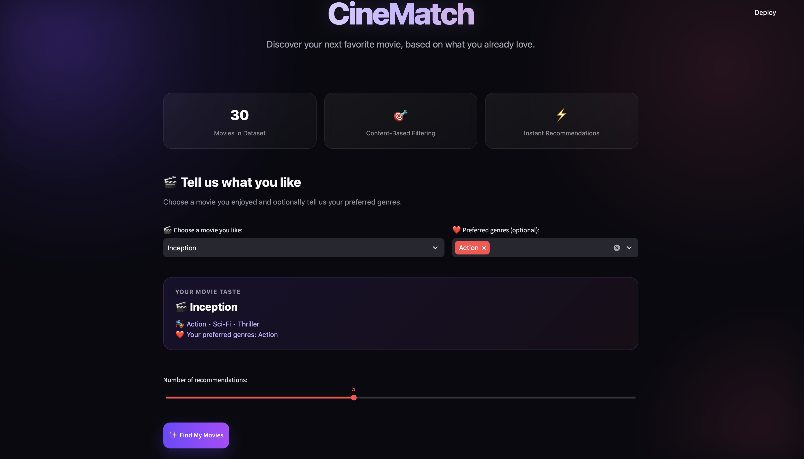
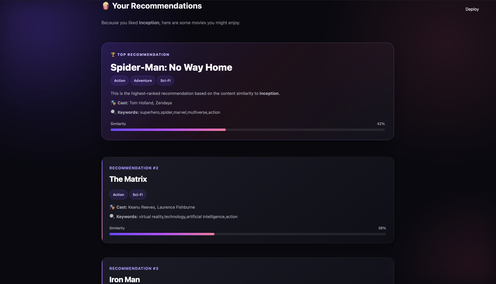

# 🎬 CineMatch — Movie Recommendation System

### CODSOFT Internship — Task 4

CineMatch is a content-based movie recommendation system that suggests movies based on the user's selected movie and optional genre preferences.

The system uses **TF-IDF Vectorization** and **Cosine Similarity** to analyze movie information and find similar movies.

---

## ✨ Features

- 🎬 Select a movie you already like
- ❤️ Choose optional preferred genres
- 🍿 Get personalized movie recommendations
- 🏆 Highlight the top recommendation
- 📊 View similarity percentages
- 🎭 View movie genres and cast
- 🔍 View movie keywords
- 🧠 Visual explanation of the recommendation process
- 🎨 Modern cinematic user interface
- ⚡ Instant recommendations using Streamlit

---

## 🖥️ Application Preview

### Home Screen



### Recommendations



---

## 🧠 How It Works

CineMatch uses **Content-Based Filtering**.

The system follows these steps:

```text
             🎬 User Selects Movie
                       ↓
              🔤 Movie Features
                       ↓
              🧮 TF-IDF Vectorization
                       ↓
              📐 Cosine Similarity
                       ↓
              📊 Similarity Ranking
                       ↓
               🍿 Recommendations